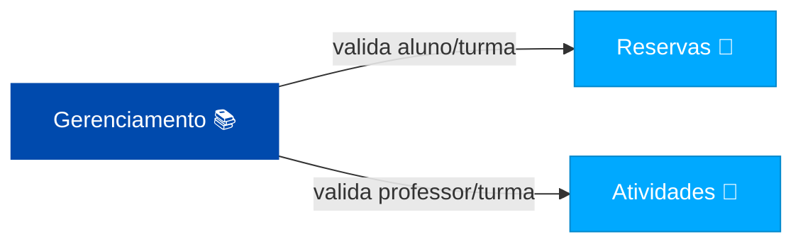

# 🏫 Sistema de Gerenciamento Escolar — Microsserviços com Flask & Docker


## 📘 Descrição Geral

Este projeto implementa um **sistema escolar baseado em microsserviços**, utilizando **Flask**, **Swagger**, **SQLAlchemy** e **Docker**.

Cada serviço é independente e possui seu próprio banco de dados **SQLite**.  
A comunicação entre serviços é feita via **requisições HTTP internas**, permitindo escalabilidade e modularidade — uma arquitetura moderna e totalmente containerizada.

---

## 🧱 Arquitetura dos Serviços



| Serviço | Porta | Função | Banco |
|----------|-------|--------|--------|
| **Gerenciamento** | `5001` | CRUD de Alunos, Professores e Turmas | `gerenciamento.db` |
| **Reservas** | `5002` | Criação de reservas (valida aluno/turma via Gerenciamento) | `reservas.db` |
| **Atividades** | `5003` | Cadastro de atividades (valida professor/turma via Gerenciamento) | `atividades.db` |

Todos os serviços estão conectados na **rede Docker interna (`escola-net`)**.

---

## ⚙️ Tecnologias Utilizadas

- 🐍 **Python 3.12**
- 🌐 **Flask** — Framework Web
- 📘 **Flasgger** — Integração Swagger UI
- 🧩 **Flask-SQLAlchemy** — ORM e persistência
- 🗃 **SQLite** — Banco de dados leve e independente
- 🐳 **Docker / Docker Compose** — Containerização e orquestração

---

## 🧩 Estrutura do Projeto

```
escola-micro/
│
├── gerenciamento/
│   ├── app/
│   │   ├── __init__.py
│   │   ├── models.py
│   │   └── routes.py
│   ├── Dockerfile
│   ├── requirements.txt
│   ├── wsgi.py
│   └── gerenciamento.db
│
├── reservas/
│   ├── app/
│   ├── Dockerfile
│   ├── requirements.txt
│   ├── wsgi.py
│
├── atividades/
│   ├── app/
│   ├── Dockerfile
│   ├── requirements.txt
│   ├── wsgi.py
│
├── docker-compose.yml
└── README.md
```

---

## 🧠 Como Rodar o Projeto (modo Docker)

### 🐳 1️⃣ Subir tudo com Docker Compose
Na raiz do projeto:
```bash
docker compose up -d --build
```

Isso criará os três containers e conectará todos na rede `escola-net`.

---

### 🧪 2️⃣ Acessar os serviços

| Serviço | Health Check | Swagger Docs |
|----------|---------------|---------------|
| Gerenciamento | [http://localhost:5001/api/health](http://localhost:5001/api/health) | [http://localhost:5001/apidocs](http://localhost:5001/apidocs) |
| Reservas | [http://localhost:5002/health](http://localhost:5002/health) | [http://localhost:5002/apidocs](http://localhost:5002/apidocs) |
| Atividades | [http://localhost:5003/health](http://localhost:5003/health) | [http://localhost:5003/apidocs](http://localhost:5003/apidocs) |

---

### 🔄 3️⃣ Parar os containers
```bash
docker compose down
```

---

## 💻 Como Rodar Manualmente (sem Docker)

1️⃣ Ativar o ambiente virtual:
```powershell
.\.venv\Scripts\Activate.ps1
```

2️⃣ Instalar dependências:
```bash
pip install -r requirements.txt
```

3️⃣ Rodar o servidor:
```bash
python wsgi.py
```

---

## 📡 Comunicação entre os Serviços

- **Reservas → Gerenciamento**  
  Antes de criar uma reserva, o serviço *Reservas* valida:
  ```http
  GET http://gerenciamento:5001/api/alunos/{id}
  GET http://gerenciamento:5001/api/turmas/{id}
  ```

- **Atividades → Gerenciamento**  
  Antes de criar uma atividade, o serviço *Atividades* valida:
  ```http
  GET http://gerenciamento:5001/api/professores/{id}
  GET http://gerenciamento:5001/api/turmas/{id}
  ```

---

## 📋 Exemplo de Fluxo Completo

1️⃣ **Criar Aluno e Turma**
   - Acesse o Swagger do Gerenciamento → [http://localhost:5001/apidocs](http://localhost:5001/apidocs)

2️⃣ **Criar Reserva**
   - Acesse [http://localhost:5002/apidocs](http://localhost:5002/apidocs)
   - Exemplo de JSON:
     ```json
     {
       "aluno_id": 1,
       "turma_id": 1
     }
     ```

3️⃣ **Criar Atividade**
   - Acesse [http://localhost:5003/apidocs](http://localhost:5003/apidocs)
   - Exemplo de JSON:
     ```json
     {
       "titulo": "Trabalho de Matemática",
       "descricao": "Resolver 10 exercícios",
       "professor_id": 1,
       "turma_id": 1
     }
     ```

---

## 🧾 Autor

**Desenvolvido por:** Geovane Soares e Richard Ferreira
💻 Projeto acadêmico baseado em arquitetura de microsserviços com Flask e Docker  
📅 Ano: 2025  
📧 **geovane_soares01@outlook.com**

---

## ✅ Licença
Este projeto é de uso livre para fins acadêmicos e de aprendizado.
